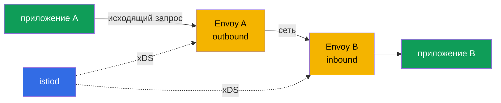

___
___
# Tags
#kubernetes
___
# Содержание
- [[#1. Роль Envoy]]
- [[#2. Основные сущности конфигурации]]
- [[#3. Динамическая доставка через xDS]]
- [[#4. Как работает инъекция]]
- [[#5. Путь запроса через sidecar]]
- [[#6. Диагностика и ресурсы]]
- [[#7. Как запрос проходит через sidecar]]
- [[#8. Практическая диагностика]]
- [[#9. Что передаётся через xDS]]
___
# 1. Роль Envoy

Envoy — высокопроизводительный L7-прокси, который понимает HTTP, HTTP/2, gRPC и TCP. В Istio он является data plane: принимает и отправляет реальный трафик, применяет маршруты и политики, собирает метрики, access-логи и трассировки.

`istiod` не находится на пути пользовательского запроса. Он только готовит конфигурацию для Envoy. Благодаря фильтрам, динамической конфигурации и расширениям через Wasm/EnvoyFilter Envoy подходит и для sidecar, и для edge-шлюза.

___
# 2. Основные сущности конфигурации

Конфигурация Envoy раскладывается в цепочку:

- **Listener** — адрес и порт, на котором принимается трафик;
- **Route** — правила выбора направления по хосту, пути или заголовкам;
- **Cluster** — логическая группа получателей с политиками балансировки;
- **Endpoint** — конкретный IP и порт пода.

Почти любой ресурс Istio в итоге превращается в одну или несколько этих сущностей.

___
# 3. Динамическая доставка через xDS

Istio передаёт конфигурацию Envoy через xDS API:

- `LDS` — listeners;
- `RDS` — routes;
- `CDS` — clusters;
- `EDS` — endpoints;
- `SDS` — сертификаты и секреты для mTLS.

После изменения `VirtualService` или `DestinationRule` `istiod` пересчитывает нужные объекты и отправляет их прокси без перезапуска пода.

___
# 4. Как работает инъекция

Sidecar появляется благодаря `MutatingWebhookConfiguration`. При `CREATE` пода kube-apiserver вызывает endpoint `/inject` у `istiod`, получает JSON-patch и сохраняет уже изменённый манифест в etcd. В под добавляются `istio-proxy`, init-контейнер и нужные тома.

Webhook выбирает namespace по меткам injection/revision. Поэтому инъекция срабатывает для новых подов; готовый под не изменяется. Точечное включение задают на `spec.template.metadata` Deployment:

```yaml
metadata:
  labels:
    sidecar.istio.io/inject: "true"
```

___
# 5. Путь запроса через sidecar

Перенаправление iptables отправляет исходящий трафик приложения в outbound listener Envoy. Прокси выбирает маршрут, endpoint и политику, затем устанавливает соединение с целевым подом. Входящий трафик сначала принимает inbound listener sidecar получателя, после чего передаёт запрос приложению.

Отсюда следуют два практических правила: приложение обычно не знает о прокси, а исключения из перенаправления (`include/exclude ports`, `include/exclude IP ranges`) могут изменить ожидаемый путь.

___
# 6. Диагностика и ресурсы

Полезные команды:

```bash
istioctl proxy-status
istioctl proxy-config listeners <pod>
istioctl proxy-config routes <pod>
kubectl logs <pod> -c istio-proxy
kubectl exec <pod> -c istio-proxy -- pilot-agent request GET stats
```

Проверяйте, что Envoy синхронизирован (`SYNCED`), что маршрут присутствует и что endpoint имеет адрес. Частые причины проблем — неверная метка injection, под создан до метки, отсутствие маршрута или конфликт портов приложения и sidecar.

___
# 7. Как запрос проходит через sidecar



Исходящий sidecar выбирает маршрут и endpoint, затем устанавливает соединение. Входящий sidecar принимает запрос и передаёт его приложению. Поэтому при ошибке нужно проверять обе стороны, а успешный DNS сам по себе не доказывает, что сработал нужный `VirtualService`.

Перенаправление можно ограничивать настройками include/exclude для портов и IP-диапазонов. Конфликт порта приложения с listener Envoy или исключённый порт часто объясняет, почему часть трафика обходит mesh.

___
# 8. Практическая диагностика

Полезная последовательность: убедиться, что под имеет `istio-proxy`; проверить `istioctl proxy-status`; посмотреть listeners, routes, clusters и endpoints; затем изучить логи sidecar и приложения.

```bash
istioctl proxy-status
istioctl proxy-config listeners <pod>
istioctl proxy-config routes <pod>
istioctl proxy-config clusters <pod>
kubectl logs <pod> -c istio-proxy
```

Отсутствующий listener означает проблему входа, отсутствие route — неверное правило, пустой cluster — проблему discovery или selector, а отсутствие endpoint — проблему Service или readiness.

___
# 9. Что передаётся через xDS

| Канал | Что получает Envoy | Пример результата |
|---|---|---|
| LDS | listeners | inbound/outbound порты |
| RDS | routes | host, path, headers |
| CDS | clusters | сервис и его политика |
| EDS | endpoints | IP и порт пода |
| SDS | secrets | сертификаты для mTLS |

Если обновился `VirtualService`, обычно меняются routes. Если появился новый под, обновляется список endpoints. Это объясняет, почему разные части proxy-конфигурации могут иметь разные версии и состояние синхронизации.

___
# 10. Итоги

Envoy обслуживает трафик, `istiod` динамически раздаёт ему конфигурацию через xDS, а mutating webhook добавляет sidecar до записи пода в etcd. Понимание listener → route → cluster → endpoint существенно упрощает диагностику.
