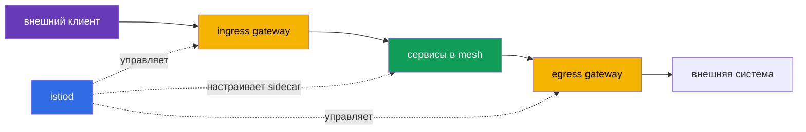
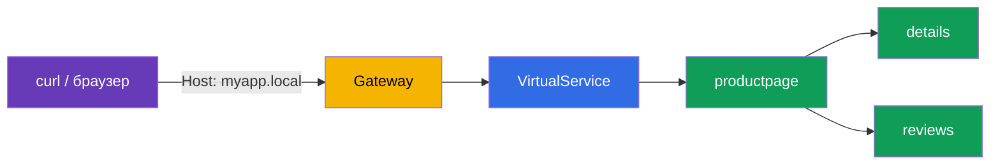
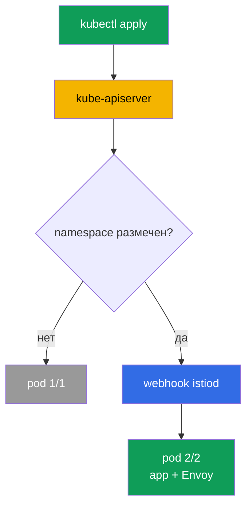

___
___
# Tags
#kubernetes
___
# Содержание
- [[#1. Инструмент управления]]
- [[#2. Профили установки]]
- [[#3. Что появляется в кластере]]
- [[#4. Автоматическая инъекция sidecar]]
- [[#5. Bookinfo и входящий трафик]]
- [[#6. Настройка через IstioOperator]]
- [[#7. Проверка установленного mesh]]
- [[#8. Удаление и жизненный цикл]]
___
# 1. Инструмент управления

`istioctl` — основной CLI Istio: устанавливает control plane, проверяет конфигурацию и помогает диагностировать Envoy. Версию клиента можно проверить отдельно от кластера:

```bash
istioctl version --remote=false
```

___
# 2. Профили установки

Профиль — готовый набор компонентов и настроек:

| Профиль | Назначение |
|---|---|
| `default` | обычный старт, `istiod` и ingress gateway |
| `demo` | обучение: ingress/egress и подробные логи |
| `minimal` | только `istiod`, шлюзы устанавливаются отдельно |
| `empty` | пустая основа для полной кастомизации |
| `preview` | экспериментальные возможности |

Для лабораторных работ удобен `demo`, для production-подобного старта обычно берут `default` и явно описывают нужные компоненты.

```bash
istioctl install --set profile=demo -y
istioctl verify-install
```

Перед установкой полезно проверить контекст Kubernetes и доступность API-сервера:

```bash
kubectl config current-context
kubectl cluster-info
kubectl get nodes
```

Версию `istioctl` лучше фиксировать в CI и в документации. Версия CLI, control plane и CRD должны быть совместимы; случайное использование бинарника от другой установки усложняет диагностику.

___
# 3. Что появляется в кластере

Основные компоненты находятся в `istio-system`:

- `istiod` — control plane;
- `istio-ingressgateway` — входящий Envoy;
- `istio-egressgateway` — управляемый выходящий трафик, обычно присутствует в `demo`.



___
# 4. Автоматическая инъекция sidecar

Инъекция включается меткой namespace:

```bash
kubectl label namespace default istio-injection=enabled
kubectl rollout restart deployment -n default
```

При создании нового пода kube-apiserver вызывает mutating webhook Istio. Webhook добавляет контейнер `istio-proxy` и init-контейнер для настройки перенаправления трафика. Уже существующие поды не меняются, поэтому их нужно пересоздать или перезапустить.

Признак успешной инъекции — `READY 2/2`. Локально включить или выключить её можно аннотацией/меткой `sidecar.istio.io/inject` на шаблоне пода, а не на самом Deployment.

Проверить метку namespace и состав контейнеров можно так:

```bash
kubectl get namespace default --show-labels
kubectl get pod -o wide
kubectl describe pod <pod-name>
```

Если под остался `1/1`, стоит проверить, что namespace размечен до создания пода, webhook существует и сам `istiod` готов. Простой перезапуск Deployment запускает новые поды, которые снова проходят admission.

___
# 5. Bookinfo и входящий трафик

Bookinfo состоит из `productpage`, `details`, `reviews` и `ratings`; у `reviews` есть версии `v1`, `v2` и `v3`. После инъекции поды работают как два контейнера: приложение и Envoy.

Внешний доступ строится через два ресурса Istio: `Gateway` описывает, на каких портах и хостах слушать ingress gateway, а `VirtualService` определяет, куда передать запрос.



Для `NodePort` нужен адрес ноды и фиксированный порт, для `LoadBalancer` — внешний IP или DNS. В локальном кластере дополнительно может понадобиться запись в `/etc/hosts`.

___
# 6. Настройка через IstioOperator

`IstioOperator` описывает инфраструктуру установки: профиль, включённые компоненты, тип Service шлюза, порты и ресурсы. Вложенный `meshConfig` описывает поведение работающего mesh, например формат access-логов и настройки трейсинга.

Не стоит смешивать эти уровни. Изменение `components.ingressGateways` меняет Kubernetes-ресурсы установки, а `meshConfig` влияет на поведение control plane и прокси. Конфигурацию лучше хранить как отдельный YAML и применять повторяемо, а не редактировать Deployment вручную.

```yaml
apiVersion: install.istio.io/v1alpha1
kind: IstioOperator
spec:
  profile: default
  meshConfig:
    accessLogFile: /dev/stdout
  components:
    ingressGateways:
    - name: istio-ingressgateway
      enabled: true
      k8s:
        service:
          type: LoadBalancer
```

Удаление установки: `istioctl uninstall --purge -y`; после этого отдельно убирают метку injection с namespace.

Уже запущенные поды с sidecar не превращаются автоматически в обычные. После снятия метки namespace их пересоздают, если нужно убрать Envoy из workload. CRD и пользовательские ресурсы также стоит удалять осознанно, особенно если кластер используется не только для учебных экспериментов.

___
# 7. Проверка установленного mesh

Перед установкой полезно проверить контекст Kubernetes и доступность API-сервера:

```bash
kubectl config current-context
kubectl cluster-info
kubectl get nodes
kubectl get pods -n istio-system
```

После включения injection смотрят метки namespace и состав контейнеров:

```bash
kubectl get namespace default --show-labels
kubectl get pod -o wide
kubectl describe pod <pod-name>
```



Если под остался `1/1`, проверяют метку namespace, наличие webhook, готовность `istiod` и время создания пода. Метка не меняет уже существующие поды — нужен `rollout restart`.

___
# 8. Удаление и жизненный цикл

Удаление установки: `istioctl uninstall --purge -y`; после этого отдельно убирают метку injection с namespace. Уже запущенные поды с sidecar не превращаются автоматически в обычные, их нужно пересоздать.

___
# 9. Итоги

Установка состоит из control plane и шлюзов, а подключение приложений к mesh — из включения injection и пересоздания подов. `IstioOperator` отвечает за состав установки, `MeshConfig` — за поведение mesh.
