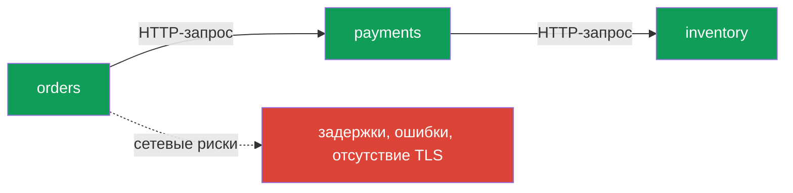
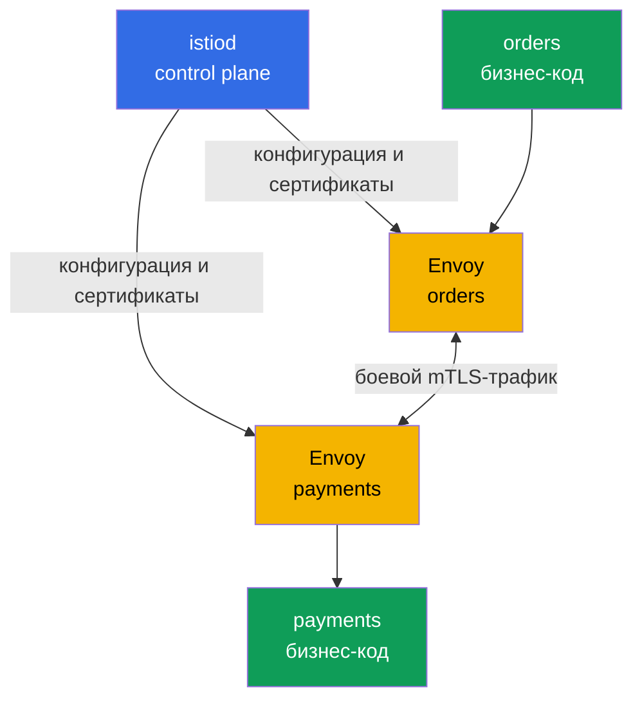
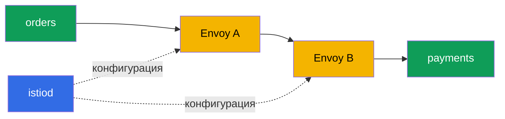

___
___
# Tags
#kubernetes
___
# Содержание
- [[#1. Зачем микросервисам service mesh]]
- [[#2. Плоскости данных и управления]]
- [[#3. Как Istio встраивается в Kubernetes]]
- [[#4. Возможности и границы применения]]
- [[#5. Как запрос проходит через mesh]]
- [[#6. Что проверить до внедрения]]
___
# 1. Зачем микросервисам service mesh

В монолите вызов между компонентами — это вызов функции внутри одного процесса. В микросервисной архитектуре каждая стрелка становится сетевым запросом: сеть может задержать, потерять или отклонить запрос, а сервис может перезапуститься в любой момент.

Kubernetes хорошо решает базовые задачи: Service и DNS дают обнаружение, kube-proxy распределяет L4-соединения, Ingress принимает внешний HTTP-трафик, NetworkPolicy ограничивает IP и порты. Но из коробки Kubernetes не даёт полноценной HTTP-маршрутизации между сервисами, mTLS, единых ретраев и таймаутов, а также детальной картины взаимодействий.

Service mesh выносит сетевую обвязку из бизнес-кода в инфраструктурный слой. Приложение продолжает делать обычный HTTP-запрос, а прокси рядом с ним добавляет маршрутизацию, шифрование, устойчивость и телеметрию. Поэтому общие политики не приходится реализовывать отдельно на Go, Java и Python.

На каждой сетевой стрелке нужно отдельно решать вопросы маршрутизации, повторов, таймаутов, шифрования и диагностики. Если эти решения живут в коде сервисов, политика быстро начинает расходиться.

___
# 2. Плоскости данных и управления

- **Data plane** — прокси, через которые проходит реальный трафик. Они выбирают endpoint, применяют правила, шифруют соединения, выполняют ретраи и собирают метрики.
- **Control plane** — управляющие компоненты. Они получают декларативные ресурсы Istio, строят конфигурацию и раздают её прокси, но пользовательский трафик через них не проходит.

В Istio control plane представлен `istiod`, а data plane — Envoy. Главное правило: control plane настраивает, data plane обслуживает запросы.

`istiod` не является прокси и не должен становиться узким местом пользовательского трафика. При недоступном control plane уже настроенные Envoy обычно продолжают обслуживать трафик, но новые изменения конфигурации и сертификатов могут перестать применяться.

___
# 3. Как Istio встраивается в Kubernetes

В sidecar-режиме Envoy запускается дополнительным контейнером в каждом поде. Правила перенаправления трафика заставляют входящие и исходящие соединения приложения проходить через локальный прокси.

`istiod` получает информацию о Kubernetes Service и подах, а затем передаёт Envoy конфигурацию. Сетевые ресурсы Istio — `Gateway`, `VirtualService`, `DestinationRule` и другие — становятся правилами для прокси.

Приложение при этом обращается к обычному DNS-имени Kubernetes Service и не знает, в какой subset или зону попадёт запрос. Mesh не исправляет бизнес-ошибки и не отменяет требования к идемпотентности: повторить безопасно можно только операцию, которую действительно можно выполнить несколько раз.

В Istio есть и ambient-режим: он уменьшает зависимость от отдельного sidecar и выносит часть обработки на общий слой. Для базового понимания курса достаточно сначала освоить sidecar-модель.

___
# 4. Возможности и границы применения

Istio особенно полезен, когда сервисов много, они написаны на разных языках, нужны mTLS, постепенные релизы и единые правила трафика. Он позволяет:

- направлять запросы по хосту, пути, заголовкам и версиям;
- делать canary-релизы и зеркалировать трафик;
- задавать таймауты, ретраи, circuit breaking и failover;
- автоматически шифровать mesh-трафик и выдавать сертификаты;
- получать метрики, access-логи и трассировки без изменений приложения.

Цена — дополнительное потребление CPU и памяти, сложность диагностики и необходимость понимать, какой прокси находится на пути запроса. Для небольшого кластера с простым трафиком обычных Service, Ingress и NetworkPolicy может быть достаточно.

Другие популярные решения — Linkerd, Cilium Service Mesh, Consul и Kuma. Istio выбран в курсе из-за широких возможностей, экосистемы и использования Envoy.

## Что проверить до внедрения

- сколько CPU и памяти можно выделить под sidecar;
- какие порты и диапазоны адресов нельзя перехватывать;
- какие операции безопасно повторять;
- как будут собираться метрики и трассировки;
- как отключить injection и вернуть трафик к обычной Kubernetes-схеме.

Чем больше mesh влияет на production-трафик, тем важнее заранее иметь понятный режим отключения injection и процедуру отката правил.

___
# 5. Как запрос проходит через mesh

Приложение обращается к обычному DNS-имени Kubernetes Service. Локальный Envoy перехватывает исходящее соединение, получает от `istiod` маршрут и отправляет запрос на Envoy целевого пода. Ответ проходит обратным путём.

Такой путь даёт единое место для политик, но добавляет стоимость: каждый под получает дополнительный контейнер, а диагностика требует учитывать как приложение, так и прокси.

# 6. Что проверить до внедрения

- сколько CPU и памяти можно выделить под sidecar;
- какие порты и диапазоны адресов нельзя перехватывать;
- какие операции безопасно повторять;
- как будут собираться метрики и трассировки;
- как отключить injection и вернуть трафик к обычной Kubernetes-схеме.

Istio особенно полезен при большом числе сервисов и строгих требованиях к безопасности. Для маленького кластера с простым трафиком Service, Ingress и NetworkPolicy могут быть достаточны.

___
# 7. Итоги

Service mesh — инфраструктурный слой для общения сервисов. В Istio `istiod` управляет конфигурацией, а Envoy пропускает данные. Sidecar делает сетевые возможности прозрачными для приложения, но добавляет накладные расходы и новый слой для диагностики.
