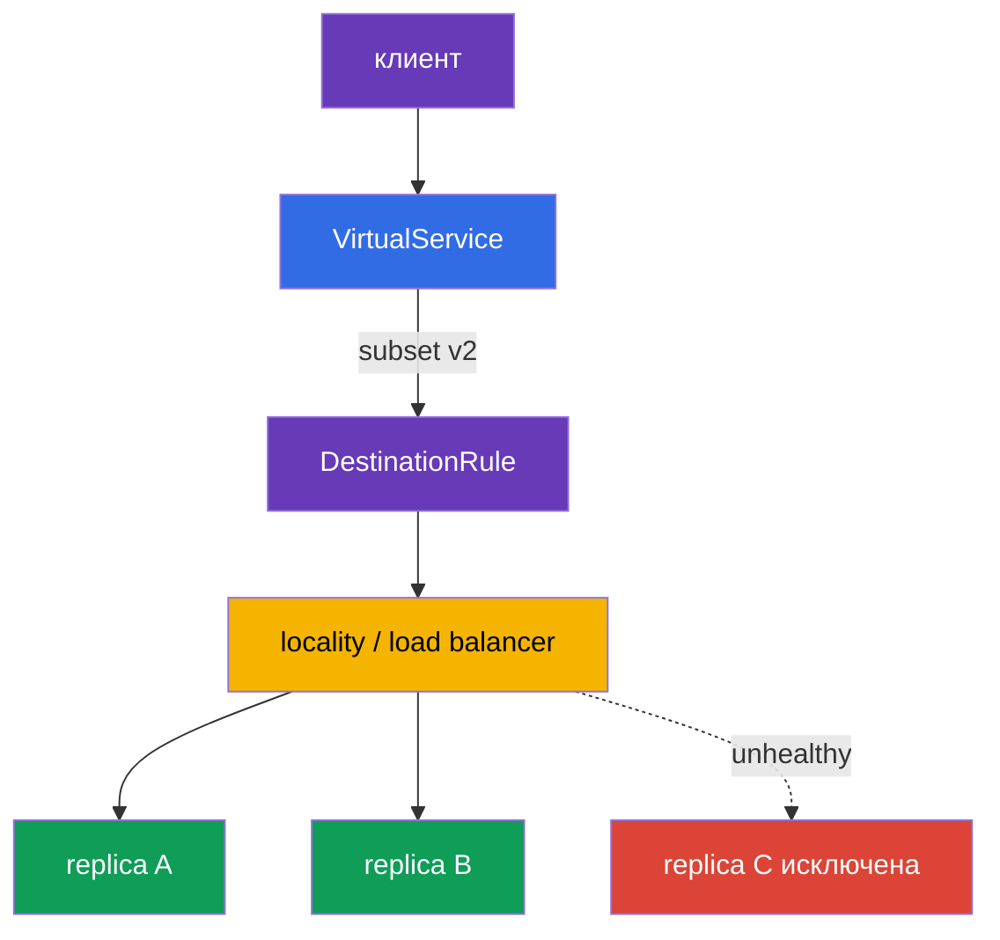

___
___
# Tags
#kubernetes
___
# Содержание
- [[#1. Где происходит балансировка]]
- [[#2. Алгоритмы выбора реплики]]
- [[#3. Locality-aware]]
- [[#4. Failover и распределение по зонам]]
- [[#5. Практические рекомендации]]
- [[#6. Диагностика распределения]]
- [[#7. Сравнение алгоритмов]]
___
# 1. Где происходит балансировка

Обычный Kubernetes балансирует L4-соединения через правила ноды, подготовленные kube-proxy. В mesh исходящий sidecar Envoy получает endpoints и сам выбирает IP пода, поэтому применяются L7-политики Istio.

Алгоритм задаётся в `DestinationRule`:

```yaml
trafficPolicy:
  loadBalancer:
    simple: LEAST_REQUEST
```

___
# 2. Алгоритмы выбора реплики

- `ROUND_ROBIN` — по очереди;
- `LEAST_REQUEST` — на реплику с меньшим числом активных запросов;
- `RANDOM` — случайный выбор;
- `PASSTHROUGH` — передача на исходный адрес без обычной балансировки.

Для sticky-сессий используется `consistentHash`: ключом может быть HTTP-заголовок, cookie, query-параметр или source IP. Это прилипание, а не гарантия равномерности; при изменении числа реплик часть ключей переедет.

`portLevelSettings` позволяет выбрать отдельный алгоритм для конкретного порта. Для новых реплик полезен `warmupDurationSecs`, чтобы не отдавать им сразу весь пик.

___
# 3. Locality-aware

Locality-aware балансировка старается отправлять трафик в ту же region/zone, где находится клиент или реплика. Istio получает топологию из меток нод Kubernetes, например `topology.kubernetes.io/zone`. Это сокращает задержку и стоимость cross-zone трафика.

Настройка выполняется в `DestinationRule` через `localityLbSetting`. Kubernetes `trafficDistribution: PreferClose` работает через kube-proxy и относится к трафику вне mesh; он не управляет запросом, который уже перехватил Envoy.

___
# 4. Failover и распределение по зонам

`failover` описывает, куда уйти при отказе локальной зоны. Чтобы Istio понял, что endpoint нездоров, обычно нужен `outlierDetection`:

```yaml
trafficPolicy:
  loadBalancer:
    localityLbSetting:
      enabled: true
      failover:
      - from: eu-central-1a
        to: eu-central-1b
  outlierDetection:
    consecutive5xxErrors: 3
    interval: 10s
    baseEjectionTime: 30s
```

`distribute` задаёт нормальное процентное распределение, например 80% локально и 20% в соседнюю зону. `failover` описывает аварийное переключение — это разные механизмы.

___
# 5. Практические рекомендации

- Начинайте с `LEAST_REQUEST`, если запросы и реплики неоднородны.
- Используйте `consistentHash` только при реальной потребности в локальном состоянии.
- Держите несколько реплик в каждой зоне; cross-zone трафик должен быть исключением.
- Для failover настраивайте locality вместе с `outlierDetection`.
- Учитывайте panic mode: если здоровых endpoints слишком мало, Envoy может снова использовать исключённые, чтобы не обнулить доступность.

___
# 6. Диагностика распределения

Балансировка происходит после выбора host и subset. Сначала `VirtualService` может направить запрос в `reviews/v2`, затем DestinationRule выбирает конкретный endpoint внутри этой группы. Поэтому «не та версия» и «одна реплика перегружена» — разные классы проблем.



```bash
kubectl get pods -o wide -l app=reviews
istioctl proxy-config endpoints <pod> | grep reviews
```

Не следует считать locality заменой репликации. Если в зоне только один под, при его отказе трафик всё равно уйдёт в другую зону.

___
# 7. Сравнение алгоритмов

`ROUND_ROBIN` хорошо подходит для одинаковых реплик и однотипных запросов. `LEAST_REQUEST` учитывает число активных запросов и чаще лучше при разной длительности операций. `RANDOM` прост, но не учитывает текущую загрузку. `consistentHash` выбирают не ради равномерности, а ради привязки клиента к одной реплике.

Переход к `consistentHash` требует проверить, что ключ действительно присутствует у запросов. При отсутствии заголовка или cookie распределение может стать неожиданным. При масштабировании часть клиентов неизбежно переедет на другие endpoints.

___
# 8. Итоги

В mesh балансирует Envoy, а его политика задаётся в DestinationRule. Locality-aware удерживает трафик рядом, `distribute` задаёт штатные веса, `failover` переключает при аварии, а `outlierDetection` помогает обнаружить больные endpoints.
