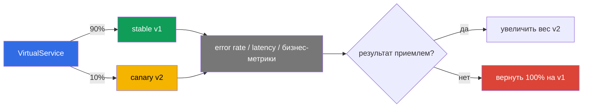

___
___
# Tags
#kubernetes
___
# Содержание
- [[#1. Deployment и release]]
- [[#2. Dark launch по заголовку]]
- [[#3. Canary с весами]]
- [[#4. Зеркалирование трафика]]
- [[#5. Последовательность безопасного выката]]
- [[#6. Наблюдение за выкатыванием]]
- [[#7. Сравнение стратегий]]
___
# 1. Deployment и release

Deployment — новая версия запущена в кластере. Release — на неё направлен пользовательский трафик. Istio разделяет эти действия: новую версию можно поднять, проверить и только потом постепенно включать для пользователей.

Все стратегии ниже используют subsets из `DestinationRule` и правила `VirtualService`.

___
# 2. Dark launch по заголовку

Тестировщиков можно отправлять на новую версию по HTTP-заголовку, оставляя остальных на стабильной:

```yaml
http:
- match:
  - headers:
      x-user:
        exact: tester
  route:
  - destination: {host: reviews, subset: v3}
- route:
  - destination: {host: reviews, subset: v1}
```

Правила проверяются сверху вниз. По тому же принципу можно сопоставлять URI, метод и query-параметры.

___
# 3. Canary с весами

Взвешенный маршрут распределяет запросы между версиями:

```yaml
http:
- route:
  - destination: {host: reviews, subset: v1}
    weight: 90
  - destination: {host: reviews, subset: v2}
    weight: 10
```

Сумма весов должна быть 100. В процессе релиза веса изменяют, например, 90/10 → 70/30 → 50/50 → 0/100. Откат — это возврат предыдущих весов, без изменения подов.

___
# 4. Зеркалирование трафика

При mirroring клиент получает ответ от основной версии, а Envoy асинхронно отправляет копию запроса на новую. Ответ зеркала клиенту не возвращается.

```yaml
http:
- route:
  - destination: {host: reviews, subset: v1}
  mirror:
    host: reviews
    subset: v2
  mirrorPercentage:
    value: 25
```

Это позволяет увидеть реальные ошибки и нагрузку на v2 без влияния на пользователей. Но зеркальный запрос действительно выполняется: `POST` с побочным эффектом может дважды записать данные. Для таких операций нужен безопасный тестовый backend или отказ от mirroring.

___
# 5. Последовательность безопасного выката

Практичная схема: запустить v2 без трафика → прогнать тень production-трафика → дать доступ тестировщикам через header-routing → включить небольшой canary → увеличивать вес по метрикам → вернуть маршрут на v1 при проблемах.

___
# 6. Наблюдение за выкатыванием

Вес относится к маршруту Envoy и не означает точное количество запросов в коротком окне: keep-alive, HTTP/2 и разная длительность запросов меняют фактическую картину. Следующий шаг лучше принимать по окну метрик, а не по одному запросу.



На каждом шаге наблюдают error rate, latency p95/p99, saturation и бизнес-метрики. Технически успешный ответ не гарантирует, что новая версия корректно считает заказ.

___
# 7. Сравнение стратегий

| Стратегия | Кто получает новый код | Видит ли клиент ответ новой версии | Основной риск |
|---|---|---|---|
| Header-routing | выбранная аудитория | да | тестовый заголовок может попасть не тому пользователю |
| Canary | процент пользователей | да | часть пользователей получает ошибочную версию |
| Mirroring | копия запросов | нет | побочные эффекты выполняются повторно |

Для canary важно помнить о состоянии: если версии используют несовместимую схему базы или разные форматы сообщений, простой возврат веса не отменит уже выполненные изменения. Миграции данных должны быть обратно совместимыми.

___
# 8. Итоги

Header-routing выбирает аудиторию, canary распределяет реальных пользователей по весам, mirroring проверяет новую версию копиями запросов. Все три метода обратимы и меняют правила трафика, а не сами workload.
