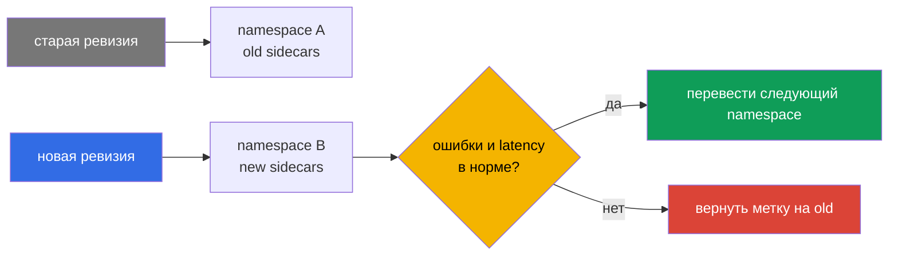

___
___
# Tags
#kubernetes
___
# Содержание
- [[#1. Почему обновление требует плана]]
- [[#2. Установка компонентов через Helm]]
- [[#3. Ревизии control plane]]
- [[#4. Canary-обновление]]
- [[#5. In-place-обновление]]
- [[#6. Выбор стратегии и откат]]
- [[#7. Контроль миграции]]
- [[#8. Canary или in-place: сравнение]]
- [[#9. Чек-лист обновления]]
___
# 1. Почему обновление требует плана

`istiod` управляет конфигурацией всех Envoy. Если заменить его напрямую и новая версия окажется несовместимой, проблемы затронут весь mesh. Поэтому обновление нужно отделять от миграции приложений и заранее оставлять возможность отката.

___
# 2. Установка компонентов через Helm

Istio в Helm разделён на общий чарт `istio/base` и чарт control plane `istio/istiod`:

```bash
helm repo add istio https://istio-release.storage.googleapis.com/charts
helm repo update
helm install istio-base istio/base -n istio-system --create-namespace
helm install istiod istio/istiod -n istio-system --wait
```

`base` содержит CRD и общие ресурсы и ставится один раз. `istiod` можно устанавливать несколькими экземплярами с разными ревизиями.

___
# 3. Ревизии control plane

Ревизия — именованный экземпляр `istiod` со своим Deployment и webhook. Метка `istio.io/rev` на namespace или поде связывает workload с нужной ревизией. Это позволяет держать старую и новую версии одновременно.

```bash
helm install istiod-1-29 istio/istiod -n istio-system \
  --set revision=1-29 --set profile=default
kubectl label namespace payments istio.io/rev=1-29
kubectl rollout restart deployment -n payments
```

___
# 4. Canary-обновление

Последовательность безопасной миграции:

1. Обновить общие CRD до совместимой версии.
2. Установить новую ревизию рядом со старой.
3. Переводить namespace или отдельные workload на новую ревизию.
4. Проверять состояние подов, `istioctl proxy-status`, метрики и ошибки.
5. После миграции удалить старую ревизию.

Ревизия по умолчанию может быть представлена тегом `default`. Смена тега удобна, когда нужно менять назначение без ручного редактирования множества namespace, но миграцию и перезапуск подов всё равно нужно контролировать.

___
# 5. In-place-обновление

При in-place-подходе старый `istiod` обновляется на месте, а прокси получают новую конфигурацию. Это проще и требует меньше ресурсов, но переключение получается общим и откат сложнее. Такой вариант подходит при совместимых изменениях и хорошей проверке в staging.

___
# 6. Выбор стратегии и откат

Canary требует больше ресурсов и дисциплины, зато позволяет мигрировать постепенно и вернуть namespace на старую ревизию. In-place быстрее, но рискованнее. В обоих случаях полезны фиксированные версии, проверка CRD, наблюдение за proxy sync и явный план удаления старого control plane.

___
# 7. Контроль миграции

Метка ревизии выбирается в момент создания пода. Поэтому после её изменения нужно перезапустить workload и проверить, что новые sidecar подключились к нужному `istiod`.



Полезно проверять `istioctl proxy-status`, `helm list`, состояние webhook и статистику 4xx/5xx. Не удаляйте старую ревизию, пока на неё ещё ссылаются namespace или поды.

___
# 8. Canary или in-place: сравнение

| Критерий | Canary через ревизии | In-place |
|---|---|---|
| Риск | ниже: миграция частями | выше: переключение общее |
| Ресурсы | нужны две копии control plane | меньше ресурсов |
| Откат | смена метки и перезапуск | сложнее, нужен rollback версии |
| Сложность | выше операционно | проще |

Для production разумнее выбрать canary, а in-place оставить для совместимых обновлений и хорошо проверенного staging.

___
# 9. Чек-лист обновления

До начала работ:

- зафиксировать текущую версию Istio и Helm values;
- проверить совместимость CRD и control plane;
- обновить staging и выполнить smoke-тесты;
- определить namespace для canary;
- подготовить метрики и процедуру возврата.

Во время миграции не стоит одновременно менять сетевые политики, Gateway и версию control plane: иначе причину сбоя будет трудно отделить от самого обновления.

___
# 10. Итоги

Для production предпочтителен upgrade через ревизии: новая версия запускается рядом со старой, а приложения переходят на неё поэтапно. In-place проще, но переводит весь mesh практически одновременно.
