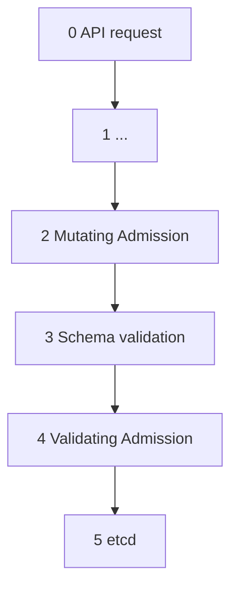
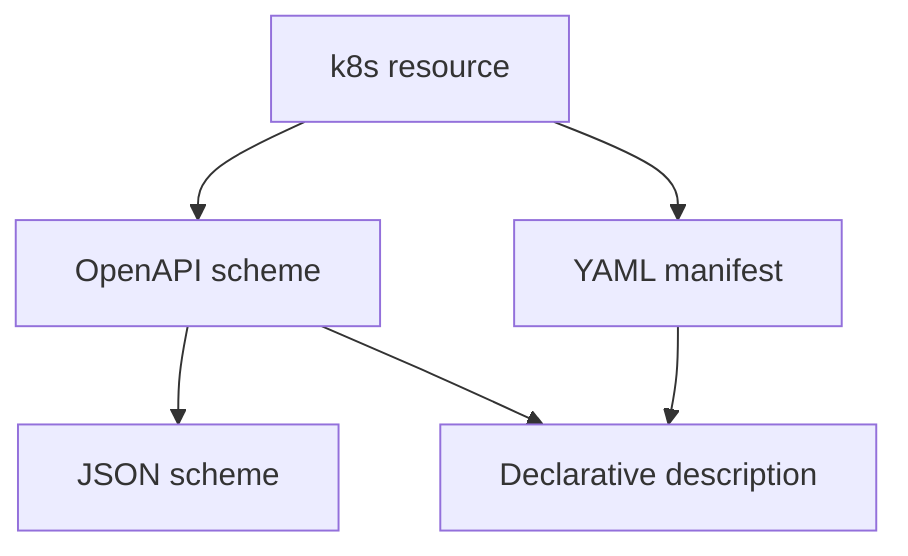

___
___
# Tags
#kubernetes 
___
# Содержание
- [[#1. Потенциальные беды с манифестами]]
	- [[#1.1. Манифест не прошел проверку Kube API]]
	- [[#1.2. Манифест не проходит Admission Review]]
	- [[#1.3. Манифест успешно применился]]
- [[#2. Где было бы хорошо внедрить проверку]]
- [[#3. Самое простое решение]]
- [[#4. Валидаторы и линтеры]]
	- [[#4.1. kubeconform]]
	- [[#4.2. kube-score]]
- [[#5. Кастомные проверки]]
	- [[#5.1. helm-unittests]]
	- [[#5.2. Rego]]
- [[#Литература]]
___
# 1. Потенциальные беды с манифестами
##### 1.1. Манифест не прошел проверку Kube API
Виной этому может быть опечатка в YAML-структуре файла, которая была замечена API k8s на этапе валидации. Такую ошибку обычно легко устранить и она некритична.
##### 1.2. Манифест не проходит Admission Review
По-простому, срабатывают политики *Kyberno* или *Gatekeeper*. Тут ситуация уже может быть более мрачной.
*Пример*: 
- Политика Kyverno может требовать факт того, что какой-то образ скачивается из регистри `docker.my-company-registry.com`. Для исправления могут потребоваться более серьезные усилия.
- Контейнер с приложением запускается от root'а. Придется менять архитектуру приложения....
##### 1.3. Манифест успешно применился
Приложение не работает/работает не так как надо/не проходит аудит ИБ, а вы уже на проде.
___
# 2. Где было бы хорошо внедрить проверку
Пытаемся в shift-left testing, отодвигая обнаружение ошибки как можно левее по временной оси.



Топ, в какой момент лучше всего перехватить ошибку:
1. Между *2* и *3* (До валидации схемы);
2. Между *3* и *4* (Поймали политики Kyverno);
3. Между *4* и *5* (Совсем плохо. Некорректны манифест доехал до etcd).
___
# 3. Самое простое решение
```shell
kubectl apply -f all.yaml --dry-run=server
```
Принцип действия:
- Валидация относительно k8s ресурсов;
- Проверка политик
- Резолв объектов

То есть единственный шаг, который не выполняется - запись в etcd.

Способ очень дешевый, но есть минусы:
1. Нужен кластер;
2. Этот кластер должен быть либо продом, либо его эквивалентом;
3. Команда может долго выполняться, ввиду большого количества этапов работы машинерии кластера.

Отутствие подходящего кластера можно пытаться обыграть с помощью временно поднятых k0s/Minikube, можно поднять синтетический control-plane.Но все эти вещи заметно "удорожают" данное решение, оно становится менее выгодным.
___
# 4. Валидаторы и линтеры
Диалектика k8s-ресурса:

## 4.1. kubeconform
- На вход принимает JSON-схемы
- CRD обрабатывается отдельно
- Не нужен Kube API
- O(1) почти, так как просто чтение текста
(Схемы есть как для ванильного k8s, так и для CRD)
## 4.2. kube-score
- Фактически является линтером
- Все правила вшиты в него
- Нельзя добавить свои, можно только отключить имеющиеся

Вдвоем они хорошо работает. kubeconform смотрит всякие типы данных на соответствие, kube-score проверяет best-practices. 
___
# 5. Кастомные проверки
## 5.1. helm-unittests
 - Доступны только для чартов
 - Придется учить DSL-язык
## 5.2. Rego
- Сложнее
- Можно сделать все, что угодно
- В отличие от kube-score можно взять что-то вроде Trivy как Rego-based инструмент и дописать свои политики.
___
# Литература
- [Хардкор – K8s. Статический анализ манифестов](https://vkvideo.ru/video-231648525_456239036)

