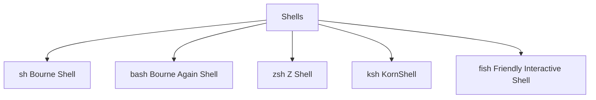

___
___
# Tags
#linux
___
# Содержание
- [[#1. Что такое shell]]
	- [[#1.1. Общая иерархия]]
- [[#2. Основные оболочки]]
- [[#3. Про каждую оболочку]]
	- [[#3.1. Sh]]
	- [[#3.2. Bash]]
	- [[#3.3. Z Shell]]
	- [[#3.4. KSh]]
	- [[#3.5. Fish]]
- [[#4. Изменение оболочки]]
	- [[#4.1. Как определить, какая оболочка используется]]
		- [[#4.1.1 Текущая оболочка по умолчанию]]
		- [[#4.1.2 Имя текущего интерпретатора]]
		- [[#4.1.3 Активный процесс оболочки]]
	- [[#4.2. Как изменить оболочку по умолчанию]]
	- [[#4.3. Как проверить доступные оболочки]]
- [[#5. Совместимость оболочек]]
- [[#6. Где используются оболочки]]
___
# 1. Что такое shell
**Оболочка (shell)** — это программа, которая предоставляет интерфейс между пользователем и ядром операционной системы. С помощью нее можно запускать команды, писать скрипты и управлять системой.
## 1.1. Общая иерархия


___
# 2. Основные оболочки
| Оболочка | Полное название            | Совместимость           | Особенности                                            |
| -------- | -------------------------- | ----------------------- | ------------------------------------------------------ |
| `sh`     | Bourne Shell               | POSIX                   | Базовая, минимальная, стандартная                      |
| `bash`   | Bourne Again Shell         | POSIX + расширения      | Наиболее популярная, используется по умолчанию         |
| `zsh`    | Z Shell                    | POSIX + свои расширения | Современная, интерактивная, настраиваемая              |
| `ksh`    | Korn Shell                 | POSIX + расширения      | Умеренно популярна, близка к `sh` и `bash`             |
| `fish`   | Friendly Interactive Shell | НЕ POSIX                | Упор на удобство, автодополнение, нетипичная синтаксис |
> [!info] 
> **POSIX** _(Portable Operating System Interface)_ — это **набор стандартов**, разработанный IEEE для обеспечения **совместимости программ** между **разными Unix-подобными операционными системами**.
> Он определяет:
> - Интерфейс командной строки
> - Поведение оболочек (shell)
> - Системные вызовы (syscalls)
> - API функций языка C
> - Стандартные утилиты и команды

___
# 3. Про каждую оболочку
## 3.1. Sh
`sh` — Bourne Shell
- **Оригинальная оболочка**, создана в 1979 году.
- Минималистичный синтаксис.
- Практически везде установлена.
- Не имеет современных удобств (`readline`, автодополнение, alias и др.)
- Часто используется в POSIX-совместимых скриптах.
## 3.2. Bash
`bash` — Bourne Again Shell
- Расширение `sh`, разработано GNU.
- Поддерживает все POSIX-функции, + свои:
    - `[[ ]]`, `(( ))`, строки here-doc (`<<<`), `=~` регулярки
    - Массивы
    - Хуки (`PROMPT_COMMAND`, `trap`)
- Установлена по умолчанию в большинстве Linux-дистрибутивов.
## 3.3. Z Shell
`zsh` — Z Shell
- Более современная и мощная оболочка.
- Совместима с `bash` и `sh`, но имеет много уникальных функций:
    - Расширенное автодополнение
    - Плагины (например, Oh My Zsh)
    - Расширенные глобальные алиасы
    - Поддержка тем
## 3.4. KSh
`ksh` — Korn Shell
- Разработана в Bell Labs в 1980-х.
- Предшественник многих фич в `bash`.
- Поддерживает скрипты от `sh`, `bash` и свои конструкции.
- Используется в IBM AIX, Solaris и др.
## 3.5. Fish
`fish` — Friendly Interactive Shell
- Не совместима с POSIX.
- Синтаксис максимально простой и читаемый.
- Интерактивная, с подсказками по командам.
- Отличный выбор для **интерактивной работы**, не для скриптов.
___
# 4. Изменение оболочки
## 4.1. Как определить, какая оболочка используется:
###### 4.1.1 Текущая оболочка по умолчанию
```shell
echo $SHELL
```
###### 4.1.2 Имя текущего интерпретатора
```shell
echo $0
```
###### 4.1.3 Активный процесс оболочки
```shell
ps -p $$
```
## 4.2. Как изменить оболочку по умолчанию:
```shell
chsh -s /bin/zsh    # сделать zsh оболочкой по умолчанию
```
## 4.3. Как проверить доступные оболочки:
```shell
cat /etc/shells
```
___
# 5. Совместимость оболочек
| Функция                | `sh` | `bash`          | `zsh` | `fish`                 |
| ---------------------- | ---- | --------------- | ----- | ---------------------- |
| POSIX-совместимость    | ✅    | ✅               | ✅     | ❌                      |
| Поддержка массивов     | ❌    | ✅               | ✅     | ✅                      |
| Поддержка плагинов/тем | ❌    | ⚠️ (ограничено) | ✅     | ✅                      |
| Удобное автодополнение | ❌    | ⚠️              | ✅     | ✅                      |
| Поддержка скриптов     | ✅    | ✅               | ✅     | ⚠️ только fish-скрипты |
___
# 6. Где используются оболочки
- `sh` — системные init-скрипты, cron, совместимость
- `bash` — повседневные скрипты, автоматизация
- `zsh` — разработка, интерактивная работа
- `fish` — пользовательская среда, удобство
- `ksh` — корпоративные системы, AIX/UNIX
___