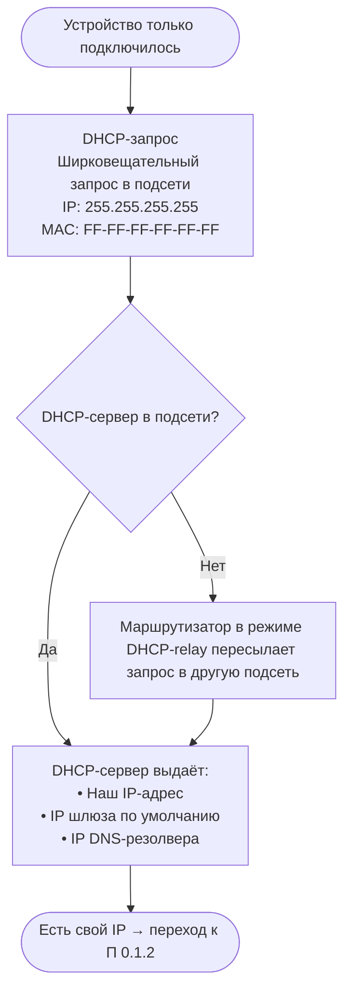
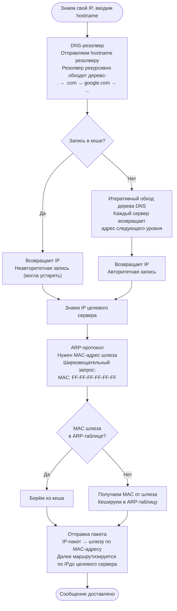
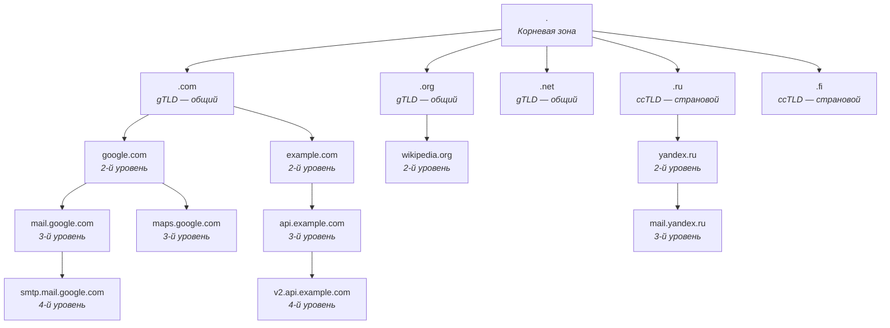

___
___
# Tags
#network
___
# Содержание
- [[#0. Шпаргалка]]
	- [[#0.1. Отправка сообщения на незнакомый IP]]
		- [[#0.1.1 Своего IP-адреса еще нет]]
		- [[#0.1.2 Свой IP-адрес в наличии]]
	- [[#0.2. Полная цепочка]]
- [[#00. Как было в начале]]
- [[#1. Уровни доменов]]
- [[#2. DNS-резолвер]]
- [[#3. DHCP-сервер]]
- [[#4. ARP-протокол]]
___
# 0. Шпаргалка
## 0.1. Отправка сообщения на незнакомый IP
### 0.1.1 Своего IP-адреса еще нет

### 0.1.2 Свой IP-адрес в наличии

## 0.2. Полная цепочка
| Шаг | Протокол | Что получаем |
|-----|----------|-------------|
| 1 | **DHCP** | Свой IP, IP шлюза, IP DNS |
| 2 | **DNS** | IP целевого сервера по hostname |
| 3 | **ARP** | MAC-адрес шлюза по его IP |
| 4 | **Ethernet/IP** | Пакет уходит через шлюз к цели |
___
# 00. Как было в начале
Сперва, когда было мало устройств в сети, сопоставление hostname и ip-адреса осуществлялось силами файла `hosts`:
```
xx.xxx.x.xxx *.ru
xxx.x.xx.xxx *.com
```
Но с увеличением количества устройств это стало абсурдно.
___
# 1. Уровни доменов


Все домены этого дерева распределены по разным серверам. Т.е. вся DNS-система является децентрализованной. А на каждом таком сервере хранится информация о нижестоящих доменах, на которые он ссылается.
## DNS-записи

| Имя домена                      | Время жизни | Класс | Значение      | Тип   | Пояснения                                       |
| ------------------------------- | ----------- | ----- | ------------- | ----- | ----------------------------------------------- |
| `mysite.ru`                     | 300         | IN    | 142.23.154.16 | A     | IPv4                                            |
| `mysite.ru`                     | 300         | IN    | 2004:0b...    | AAAA  | IPv6                                            |
| `mysite.ru`                     | 300         | IN    | 5 mail.s.ru   | MX    | Приоритет и адрес почтового сервар              |
| `mysite.ru`                     | 300         | IN    | v-spf1        | TXT   | Текстовая запись                                |
| `mysite.ru`                     | 300         | IN    | `site.ru`     | CNAME | Псевдоним                                       |
| `10.14.18.132`<br>IN-ADDR-ARPA. | 300         | IN    | `mysite.ru`   | PTR   | Домен по IP                                     |
| `mysite.ru`                     | 300         | IN    | ns.s.ru       | NS    | Адреса DNS-сервера, отвечающего за данный домен |

___
# 2. DNS-резолвер
Отправка запроса к DNS-резолверу происходит автоматически, когда вписывается адрес сайта в условной адресной строке.
DNS-резолвер начинает рекурсивный поиск нужного нам домена среди всего дерева.

Дерево, в свою очередь, осуществляет поиск итеративно. То есть, если адрес содержится, то возвращают его, а если нет, то возвращают адрес нижестоящего в дереве сервера, на котором эта запись может быть.

В итоге DNS-резолвер получает адрес нужного нам IP и возвращает его (или сразу несколько).
- Если запись была получена от DNS-сервера в дереве, она называется **авторитетной**
- Если запись была получена из кеша DNS-резолвера, она называется **не авторитетной**, так как данные могли устареть.

Вся эта информация указывается в спец. полях запроса:

| —————————————                          | 0x07A8           | ID                            |
| -------------------------------------- | ---------------- | ----------------------------- |
| 12-байтовый заголовок<br>————————————— | 0000000100000000 | Флаги                         |
|                                        | 1                | Кол-во запросов               |
|                                        | 1                | Кол-во ответов                |
|                                        | 1                | Кол-во авторитетных ответов   |
|                                        | 0                | Кол-во дополнительных записей |
| —————————————                          | 0x076578...      | Доменное имя                  |
| Запросы                                | 0x0001           | Тип DNS-записи — A            |
| —————————————                          | 0x0001           | Класс IN                      |
|                                        | 0x076578...      | Доменное имя                  |
| Ответы                                 | 0x0001           | Тип DNS-записи — A            |
|                                        | 0x0001           | Класс IN                      |
|                                        | 0x00000c90       | Время хранения записи в кеше  |
|                                        | 0x0004           | Длина данных                  |
| —————————————                          | 0x8412040A       | `132.18.4.10`                 |
| —————————————                          | Доп. ответы      |                               |
|                                        | Доп. записи      |                               |
___
# 3. DHCP-сервер
DHCP-сервер, обычно находится на стороне провайдера, отвечает как раз за выдачу нам нашего собственного IP-адреса, а также следит, чтобы они не дублировались между пользователями.

Выполняется такой запрос по одноименному протоколу **DHCP (Dynamic Host Configuration Protocol)**.
Заранее адрес DHCP-сервра нам неизвестен. Потому посылается широковещательный запрос в нашей подсети с такими адресами:
- IP: `255.255.255.255`;
- MAC: `FF-FF-FF-FF-FF-FF`
Такие запросы (широковещательные) маршрутизаторы не пересылают за пределы подсети. Таким образом, DHCP-сервер должен находиться в нашей подсети.

Если DHCP-сервера нет в нашей подсети, то маршрутизатор должен быть сконфигурирован в режим **DHCP-relay**. Данная настройка позволит маршрутизатору передать широковещательный запрос в другие подсети, но только по протоколу **DHCP**.
___
# 4. ARP-протокол
Теперь имеется свой IP-адрес, а также IP-адрес целевого сервера. Но мы все еще не можем просто так отправить на него наши данные. Это так, потому что на уровне сетевых карт своей канальной сети все пакеты будут разбиваться на кадры и отправляться по MAC-адресу. 

Не зная MAC-адреса, ничего не остается кроме как передать это все шлюзу по умолчанию, IP-адрес которого, мы знаем благодаря DHCP-серверу. Но перед этим надо узнать еще и MAC-адрес этого шлюза.

Для этого и нужен ARP-протокол, который предназначен для того, чтобы получать MAC-адрес, имея в наличии только IP-адрес.
1. Отправляется запрос по широковещательному MAC-адресу:`FF-FF-FF-FF-FF-FF`, который не будет опять же выслан маршрутизатором за пределы нашей подсети.
2. Полученный MAC-адрес кешируется в специальную ARP-таблицу:

| IP                | MAC                 | Тип                                           |
| ----------------- | ------------------- | --------------------------------------------- |
| `32.132.53.12`    | `23-0A-46-45-19-BC` | Динамический (+временный для обновления инфы) |
| `255.255.255.255` | `FF-FF-FF-FF-FF-FF` | Статический                                   |
___
